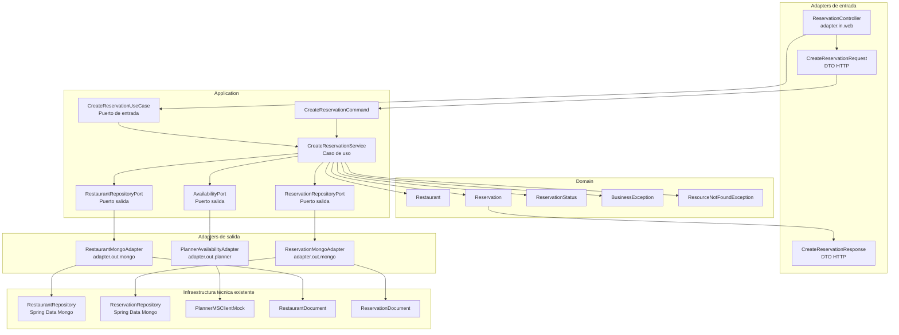
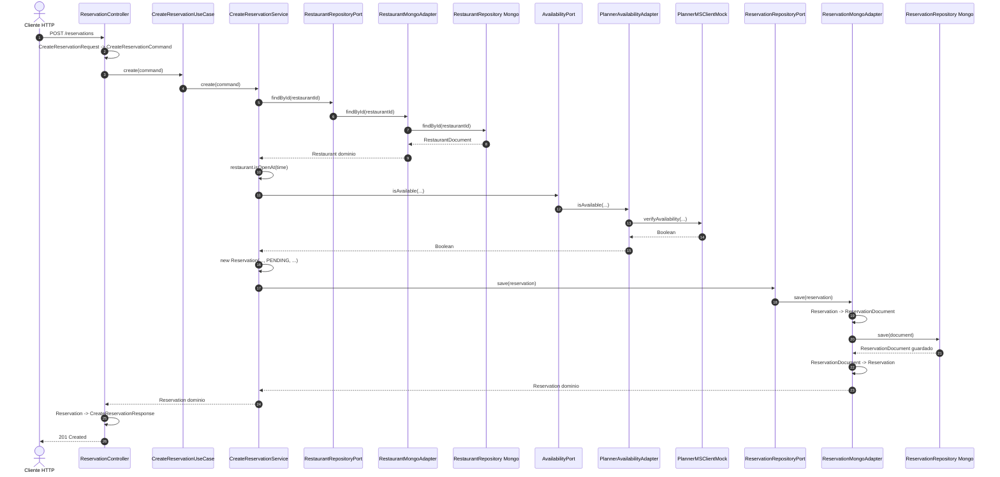
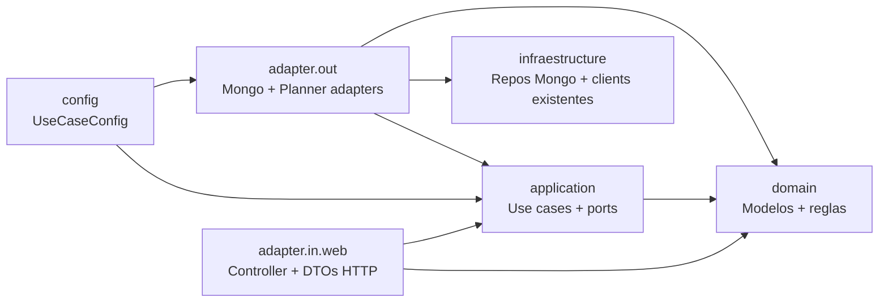
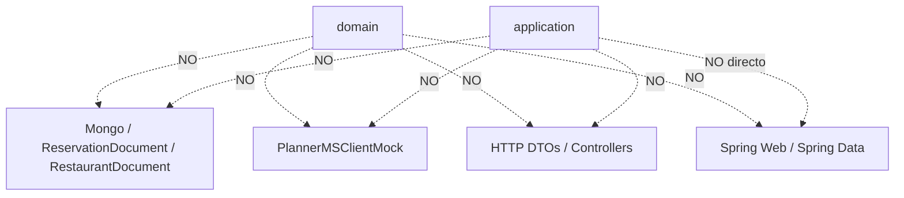
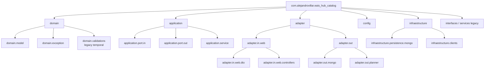
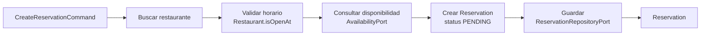
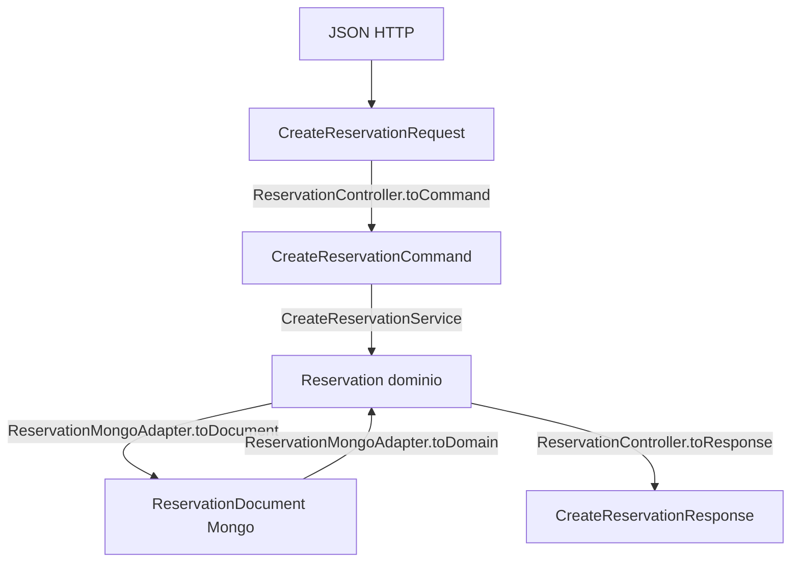

# Diagramas de arquitectura hexagonal

Estos diagramas muestran cómo va quedando la migración del módulo `eats_hub_catalog` hacia arquitectura hexagonal.

La lectura principal es:

> El centro contiene negocio y casos de uso.  
> Los bordes contienen tecnología: HTTP, Mongo, clientes externos y Spring.

---

## 1. Vista general por capas



---

## 2. Flujo de creación de reserva



---

## 3. Dependencias permitidas



Idea clave:

```text
adapter.in.web puede conocer application.
application puede conocer domain.
adapter.out puede conocer application, domain e infraestructura técnica.
domain no conoce a nadie.
```

---

## 4. Dependencias que queremos evitar



Si una clase de `domain` o `application` necesita algo externo, no lo importa directamente. Define o usa un puerto.

---

## 5. Mapa de paquetes actual



Notas:

- `domain.validations.ReservationValidator` sigue siendo legacy temporal mientras exista el flujo viejo.
- `interfaces.*` también queda como parte del diseño anterior.
- El nuevo flujo hexagonal debería crecer bajo `domain`, `application`, `adapter` y `config`.

---

## 6. Cómo leer el caso de uso nuevo



Este flujo vive en:

```text
application.service.CreateReservationService
```

Y representa la historia de negocio:

> Dado un restaurante, una fecha, una hora y un cliente, crear una reserva pendiente si el restaurante existe, está abierto y tiene disponibilidad.

---

## 7. Dónde ocurre cada transformación



Regla práctica:

```text
Los DTOs HTTP no entran al caso de uso.
Los documentos Mongo no entran al caso de uso.
El caso de uso trabaja con commands y modelos de dominio.
```
