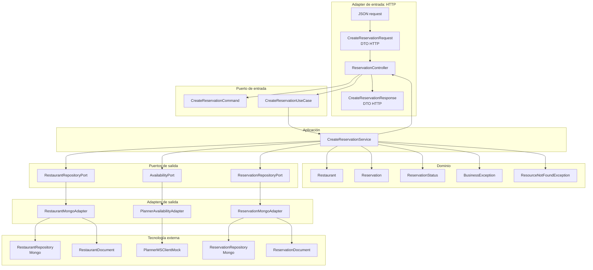
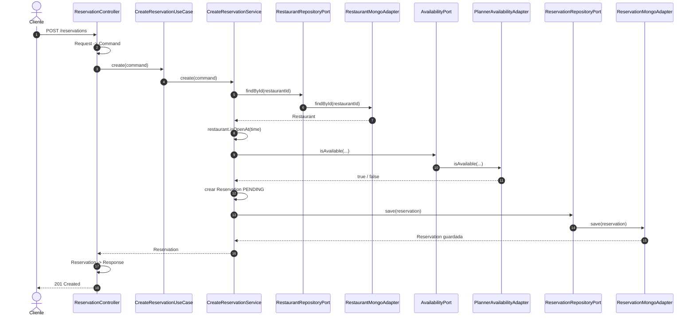
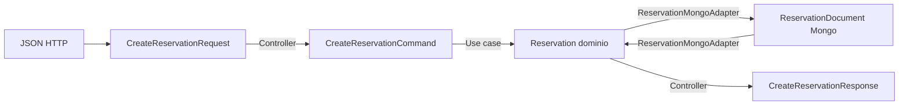

# Reservation en arquitectura hexagonal

Este documento explica únicamente el flujo de `Reservation`, para ver con claridad cómo se conectan las capas.

La idea central:

```text
La reserva se crea desde un adapter de entrada,
se procesa en un caso de uso,
usa reglas del dominio,
y sale hacia Mongo / Planner mediante puertos y adapters.
```

---

## 1. Diagrama principal de `Reservation`



---

## 2. Lectura simple del diagrama

El flujo empieza aquí:

```text
Cliente HTTP
```

El cliente envía un JSON a:

```text
POST /reservations
```

Ese JSON entra por:

```text
ReservationController
```

El controller está en el borde del sistema. Por eso es un adapter de entrada.

Su trabajo no es hacer negocio. Su trabajo es traducir:

```text
CreateReservationRequest -> CreateReservationCommand
```

Después llama al puerto de entrada:

```text
CreateReservationUseCase
```

Ese puerto está implementado por:

```text
CreateReservationService
```

---

## 3. Qué hace cada capa en `Reservation`

### Adapter de entrada

Clase principal:

```text
ReservationController
```

Responsabilidad:

```text
Recibir HTTP y traducirlo al lenguaje de la aplicación.
```

Conoce:

- JSON;
- DTOs HTTP;
- anotaciones Spring como `@RestController`;
- `CreateReservationUseCase`.

No debería conocer:

- Mongo;
- `ReservationDocument`;
- `ReservationRepository`;
- `PlannerMSClientMock`;
- reglas profundas de negocio.

---

### Puerto de entrada

Clase:

```text
CreateReservationUseCase
```

Responsabilidad:

```text
Definir qué operación ofrece la aplicación hacia fuera.
```

En nuestro caso:

```java
Mono<Reservation> create(CreateReservationCommand command);
```

Este puerto dice:

> Si quieres crear una reserva, esta es la entrada oficial.

---

### Command

Clase:

```text
CreateReservationCommand
```

Responsabilidad:

```text
Transportar los datos necesarios para ejecutar el caso de uso.
```

No es un DTO HTTP.

No es un documento Mongo.

Es el mensaje interno que entiende la aplicación.

---

### Aplicación

Clase:

```text
CreateReservationService
```

Responsabilidad:

```text
Orquestar el caso de uso.
```

Hace este flujo:

```text
1. Buscar el restaurante.
2. Si no existe, lanzar ResourceNotFoundException.
3. Validar si está abierto.
4. Consultar disponibilidad.
5. Si no hay disponibilidad, lanzar BusinessException.
6. Crear Reservation en estado PENDING.
7. Guardar Reservation.
```

Esta clase no sabe si los datos vienen de Mongo, PostgreSQL, un mock o una API.

Solo conoce puertos:

```text
RestaurantRepositoryPort
AvailabilityPort
ReservationRepositoryPort
```

---

### Dominio

Clases principales:

```text
Restaurant
Reservation
ReservationStatus
```

Responsabilidad:

```text
Representar el negocio.
```

Ejemplo:

```java
restaurant.isOpenAt(command.time())
```

Esa regla pertenece al dominio porque describe una verdad del negocio:

```text
Un restaurante solo acepta reservas dentro de su horario.
```

El dominio no debería saber nada de:

- HTTP;
- Mongo;
- Spring;
- Planner;
- DTOs;
- documentos de persistencia.

---

### Puertos de salida

Clases:

```text
RestaurantRepositoryPort
AvailabilityPort
ReservationRepositoryPort
```

Responsabilidad:

```text
Decir qué necesita la aplicación del exterior.
```

El caso de uso necesita:

```text
buscar restaurante
consultar disponibilidad
guardar reserva
```

Pero no decide cómo se hace técnicamente.

---

### Adapters de salida

Clases:

```text
RestaurantMongoAdapter
PlannerAvailabilityAdapter
ReservationMongoAdapter
```

Responsabilidad:

```text
Implementar los puertos usando tecnología concreta.
```

Por ejemplo:

```text
ReservationRepositoryPort
        lo implementa
ReservationMongoAdapter
        usando
ReservationRepository
```

Aquí sí aparecen detalles técnicos:

- Mongo;
- documentos;
- repositorios Spring Data;
- clientes externos;
- conversiones entre dominio y persistencia.

---

## 4. Flujo paso a paso



---

## 5. Dónde se traduce cada modelo



Este diagrama es muy importante.

La aplicación no trabaja con:

```text
CreateReservationRequest
ReservationDocument
CreateReservationResponse
```

La aplicación trabaja con:

```text
CreateReservationCommand
Reservation
Restaurant
```

---

## 6. Regla mental para este flujo

Piensa en `Reservation` así:

```text
Controller pregunta:
    "Quiero crear una reserva"

UseCase responde:
    "Esta es la operación disponible"

Service decide:
    "Estos son los pasos de negocio"

Domain sabe:
    "Qué es una reserva y cuándo un restaurante está abierto"

Ports dicen:
    "Necesito algo de fuera"

Adapters responden:
    "Yo sé hablar con Mongo o Planner"
```

Esa separación es la arquitectura hexagonal en acción.

